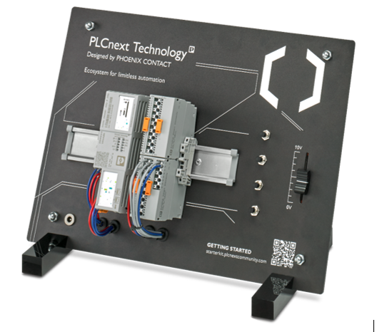

# СОДЕРЖАНИЕ

- ВВЕДЕНИЕ
    - 1 Основные сведения о предприятии
    - 2 Цели и задачи преддипломной практики
    - 3 Оборудование. Описание и характеристика
        - 3.1 Выбор программно-технической платформы для разработки
        - 3.2 Контроллер AXC F 2152 -  назначение, возможности, технические характеристики, комплектность
        - 3.3 Подключение периферии
        - 3.4 Назначение индикации контроллера AXC F 2152
    - 4 Выбор протокола для дипломного проектирования, преимущества и недостатки
- ЗАКЛЮЧЕНИЕ
- СПИСОК ИСПОЛЬЗОВАННЫХ ИСТОЧНИКОВ

# ВВЕДЕНИЕ

Студент факультета электронно-информационных систем, специальности «Автоматизированные системы обработки информации», четвёртого курса, группы АС-55, Родион Евгений Сергеевич, на период с 23 марта 2023 года по 19 апреля 2023 года, был направлен на преддипломную практику на «Кафедра ИИТ». Практику проходил в качестве практиканта.

## 1 Основные сведения о предприятии

Кафедра интеллектуальных информационных технологий была организована в 2003 году и находится на факультете электронно-информационных систем. Заведующим кафедрой является профессор, доктор технических наук, Головко Владимир Адамович. 

На кафедре обучаются студенты по специальностям: Автоматизированные системы обработки информации, Искусственный интеллект и Программное обеспечение информационных технологий. На кафедре работают 3 компьютерных класса и 5 лабораторий.

Кафедра обеспечивает профильную подготовку (общепрофессиональные, специальные дисциплины, дисциплины специализации, производственные практики, а также итоговая аттестация выпускников в виде защиты дипломного проекта / работы или магистерской диссертации).

## 2 Цели и задачи преддипломной практики

**Цель практики:** Использование в практической деятельности знаний, полученных при изучении специальных дисциплин, освоение процессов разработки, эксплуатации и сопровождения программного обеспечения.

**Задачи практики:**

- Изучение структуры и деятельности предприятия;
- Изучение информационных технологий, применяемых на предприятии;
- Сбор информации о предприятии для решения задач дипломного проектирования;
- Участие в решении производственных задач предприятия.

**Индивидуальное задание:**

- Изучить структуру предприятия и отдела прохождения практики.
- Изучить выполняемые отделом задачи.
- Изучить применяемые программно-аппаратные средства.

## 3 Оборудование. Описание и характеристика

### 3.1 Выбор программно-технической платформы для разработки

В качестве управляющего устройства в моём проекте используется PLCNext-Technology Starterkit. Это комплект, включающий все необходимое для начала работы с технологией PLCNext для промышленной автоматизации. В комплект входит устройство управления AXC F 2152 PLCNext Control, модули ввода/вывода AXL Smart Elements DI16/DO16/AI4, ползунковый потенциометр, кабель для программирования, книга стартового набора и ссылка на файл моделирования. Комплект разработан для обеспечения простого, удобного и экономически эффективного способа начать проекты с использованием технологии PLCNext. С помощью этого набора пользователи могут опробовать принцип работы, управление и высокую производительность технологии PLCNext на малогабаритной станции. Книга стартового набора также содержит пошаговое руководство, которое помогает приступить к программированию и использованию набора.

Рисунок 3.1 – PLCNext-Technology Starterkit

PLCNext-Technology - это платформа для промышленной автоматизации и систем управления. Она предлагает открытую, интегрированную и безопасную архитектуру программного обеспечения, которая позволяет пользователям быстро разрабатывать индивидуальные решения для своих конкретных потребностей. PLCNext-Technology обеспечивает гибкость использования нескольких ПЛК в одной системе, позволяя пользователям комбинировать оборудование разных производителей и при этом иметь доступ к единой среде разработки. Кроме того, она поддерживает несколько коммуникационных протоколов, в том числе EtherNet/IP, что позволяет обмениваться данными между устройствами в разных сетях или даже в разных странах.

Таким образом, мой дипломный проект посвящен разработке модуля для микроконтроллера AXC F 2152 для взаимодействия с оборудованием по протоколу EtherNet/IP. Целью данного проекта является обеспечение эффективной и надежной связи между устройствами, а также возможность применения передовых приложений промышленной автоматизации. Используя протокол EtherNet/IP, я смогу создать надежную и экономически эффективную систему, способную поддерживать высокую пропускную способность данных при сохранении низких показателей задержки. Для достижения этой цели я планирую использовать несколько инструментов разработки программного обеспечения, таких как язык программирования C/C++ и популярные библиотеки (такие как OpenECAT или ECmaster), доступные через SDK (Software Development Kit). Этот SDK включает в себя такие функции, как инструменты конфигурации сети, отладчики, компиляторы и т.д., что позволяет разработчикам, работающим с этой технологической платформой, легко создавать мощные приложения, не имея предварительных знаний о встроенных языках программирования, таких как C++ или Python, используемых некоторыми другими платформами, представленными сегодня на рынке. Встроенные функции отладки позволяют устранять неполадки в коде быстрее, чем когда-либо прежде, тем самым минимизируя время, затрачиваемое на создание успешных проектов.

### 3.2 Контроллер AXC F 2152 -  назначение, возможности, технические характеристики, комплектность

Контроллер AXC F 2152 - это контроллер для системы ввода-вывода Axioline F. Он предназначен для прямого управления модулями ввода-вывода Axioline F(система ввода-вывода в реальном времени от Phoenix Contact. Она предназначена для использования в жестких промышленных условиях и обеспечивает быстрое и простое подключение модулей ввода-вывода.) Система Axioline F имеет множество функций и возможностей, таких как измерение тока и напряжения и имеет два интерфейса Ethernet. Контроллер был разработан для обеспечения максимальной производительности и простоты использования в жестких промышленных условиях.

Рисунок 3.2 – Контроллер AXC F 2152

Контроллер AXC F 2152 имеет следующие технические характеристики:

- Ширина: 45 мм
- Высота: 126,93 мм
- Глубина: 75 мм
- Степень защиты: IP20

Рисунок 3.3 – Технические характеристики контроллера AXC F 2152

**Контроллеры AXC F 2152 обладают следующими возможностями:**

- Может быть установлено до 63 модулей ввода-вывода AXIO;
- Подключение по Ethernet;
- Поддерживаются многочисленные протоколы, такие как: http, https, FTP, OPC UA, SNTP, SNMP, SMTP, SQL, MySQL, DCP и т.д;
- Подключение к хранилищу PLCnext;
- 2 интерфейса Ethernet (встроенный коммутатор);

**Технические характеристики и комплектность:**

 Таблица 3.1 – Основные технические характеристики контроллера AXC F 2152

|Напряжение питания, В|24|
| :- | :-: |
|Максимальная потребляемая мощность, Вт|10,6|
|Электрическая прочность изоляции дискретных входов, кВ|5|
|Ethernet|Есть (2)|
|RS-485|Есть|
|Wi-Fi|Нет|
|Крепление на DIN-рейку|Есть|
|Степень защиты корпуса, IP|20|
|Рабочая температура окружающей среды, °С|-25 °C - 60 °C|
|Максимальная относительная влажность (при 25 °С), не более, %|95%|
|Габаритные размеры, мм|127х75х45|

### 3.3 Подключение периферии

Для подключения различной периферии к контроллеру AXC F 2152 вам необходимо:

1. Использовать модуль базовой шины для соединения контроллера с локальной шиной Axioline F, к которой можно подключить до 63 устройств ввода-вывода.
2. Использовать два интерфейса Ethernet для подключения контроллера к сети e.
3. Настроить параметры сети и контроллера с помощью программы Startup.
4. Создать новый проект в программе PLCnext Engineer и добавить контроллер и периферийные устройства в конфигурацию оборудования.
5. Загрузить проект в контроллер и запустить его.

К контроллеру AXC F 2152 можно подключить различные устройства ввода-вывода системы Axioline F, такие как:

- Цифровые модули ввода-вывода (например, DI8/1 DO8/1 2701916) для работы с дискретными сигналами. 
- Аналоговые модули ввода-вывода (например, AI2 AO2 2702072) для работы с аналоговыми сигналами. 
- Модули специального назначения (например, AXF BK PN 2701815) для
подключения к другим шинам.

Рисунок 3.4 – Компоненты контроллера AXC F 2152

Компоненты контроллера AXC F 2152:

- Базовый модуль шины
- Модуль электроники
- Кнопка сброса
- Держатель SD-карты
- Индикаторы диагностики и состояния
- Интерфейс Ethernet X2 
- Интерфейс Ethernet X1
- Разъем питания (разъем для подключения напряжения питания (напряжение связи UL))

### 3.4 Назначение индикации контроллера AXC F 2152

**Контроллер AXC F 2152 имеет следующие индикаторы:**

- LED PWR - показывает наличие питания на контроллере.
- LED RUN - показывает состояние работы контроллера.
- LED ERR - показывает наличие ошибок в работе контроллера
- LED ETH1 и LED ETH2 - показывают состояние соединения и активность на интерфейсах Ethernet.
- LED SD - показывает состояние карты памяти SD, если она установлена.
- LED USB - показывает состояние подключения к ПК через разъем USB C.

Рисунок 3.5 – Индикация контроллера AXC F 2152

## 4. Выбор протокола для дипломного проектирования, преимущества и недостатки

EtherNet/IP - это протокол промышленной сети, основанный на стандарте Ethernet. Он обеспечивает связь между различными устройствами, включая контроллеры, приводы, датчики и другие компоненты автоматизации. Протокол был разработан компанией Rockwell Automation в 2002 году и с тех пор получил широкое распространение в обрабатывающей промышленности. EtherNet/IP поддерживает как приложения управления в реальном времени, так и сбор данных для систем более высокого уровня, таких как SCADA или MES (Manufacturing Execution Systems). Основное преимущество использования EtherNet/IP заключается в том, что он позволяет легко интегрироваться в существующую инфраструктуру, обеспечивая при этом высокую производительность с точки зрения скорости и надежности. 

По своей сути EtherNet/IP состоит из двух основных уровней: Общий промышленный протокол (CIP), который определяет формат сообщений для обмена между различными узлами; и протокол управления передачей / интернет-протокол (TCP / IP), который обеспечивает надежную передачу данных по физическим сетям, таким как кабели Ethernet или беспроводные соединения, такие как Wi-Fi или сотовые сети. CIP инкапсулирует данные приложения в пакеты, известные как "сообщения", которые затем могут быть отправлены через уровень TCP / IP к узлу (узлам) назначения. Каждое сообщение содержит информацию о его исходном адресе, чтобы при необходимости можно было связаться с ним и ответить - эта функция обеспечивает надежную доставку всех сообщений, даже если по пути могут возникать временные проблемы с соединением из-за помех от внешних источников, таких как радиочастотный шум и т.д. 

Чтобы разработать модуль для микроконтроллера AXC F 2152, необходимо иметь глубокое понимание того, как эти протоколы работают вместе, чтобы они могли эффективно взаимодействовать с оборудованием через протокол EthrNet/IP.

Протокол Ethernet/IP имеет свои преимущества и недостатки. Он особенно хорошо подходит для подключения микроконтроллера AXC F 2152 к другому оборудованию, поскольку поддерживает передачу данных на высоких скоростях с минимальной задержкой. Кроме того, EtherNet/IP имеет встроенные функции безопасности, такие как аутентификация и шифрование, которые обеспечивают целостность передачи данных на различные расстояния. Кроме того, этот протокол обеспечивает масштабируемость в плане способности поддерживать широкий спектр сетей различных типов и размеров, не требуя дополнительных аппаратных или программных компонентов. Однако, с другой стороны, из-за его сложности могут возникнуть некоторые трудности при установке соединений между двумя различными системами с использованием этого протокола; кроме того, он может потребовать больше ресурсов, чем более простые протоколы, такие как Modbus или CANopen, из-за большего набора функций, что потенциально может привести к увеличению затрат, связанных с внедрением, по сравнению с другими доступными сегодня решениями.

# ЗАКЛЮЧЕНИЕ
В ходе прохождения производственной практики на Кафедре ИИТ в БРГТУ были выполнены следующие задачи:

- изучил основы работы с контроллером AXC F 2152;
- разработал и отладил приложение для управления и мониторинга работы контроллера с использованием интерфейсов Ethernet и Axioline F;
- оформил отчет по выполненной работе в соответствии с требованиями.

Был приобретен ценный опыт работы с современным оборудованием и технологиями автоматизации, углублены знания в области промышленной связи. Практика позволила применить полученные в университете теоретические знания, подготовиться к выполнению дипломного проекта.

# СПИСОК ИСПОЛЬЗОВАННЫХ ИСТОЧНИКОВ

1. https://www.phoenixcontact.com/en-us/products/controller-axc-f-2152-2404267. – Дата доступа: 27.03.2023.
2. https://www.phoenixcontact.com/pxc-oc-itemdetail-pdf-web/eshop?lineItemType=LineItem&UID=2404267 – Дата доступа: 27.03.2023.
3. https://www.tti.com/content/dam/ttiinc/manufacturers/phoenix-contact/doc/Phoenix-Contact-AXC-F-2152-PLCnext-Controllers-Datasheet-Specifications.pdf – Дата доступа: 27.03.2023.
4. https://www.manualslib.com/products/Phoenix-Contact-Plcnext-Axc-F-2152-10605093.html– Дата доступа: 27.03.2023.
5. https://www.mouser.com/pdfDocs/2404267.pdf – Дата доступа: 27.03.2023.
6. https://robotics.bstu.by/ – Дата доступа: 27.03.2023.

